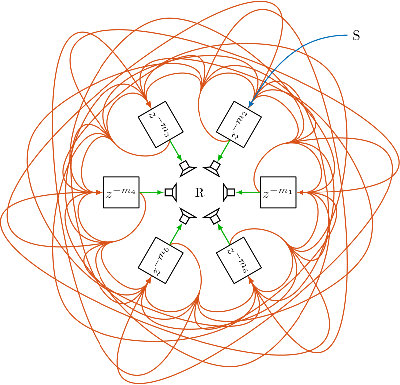
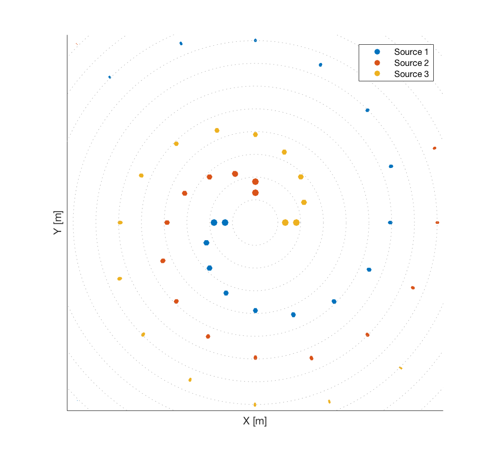
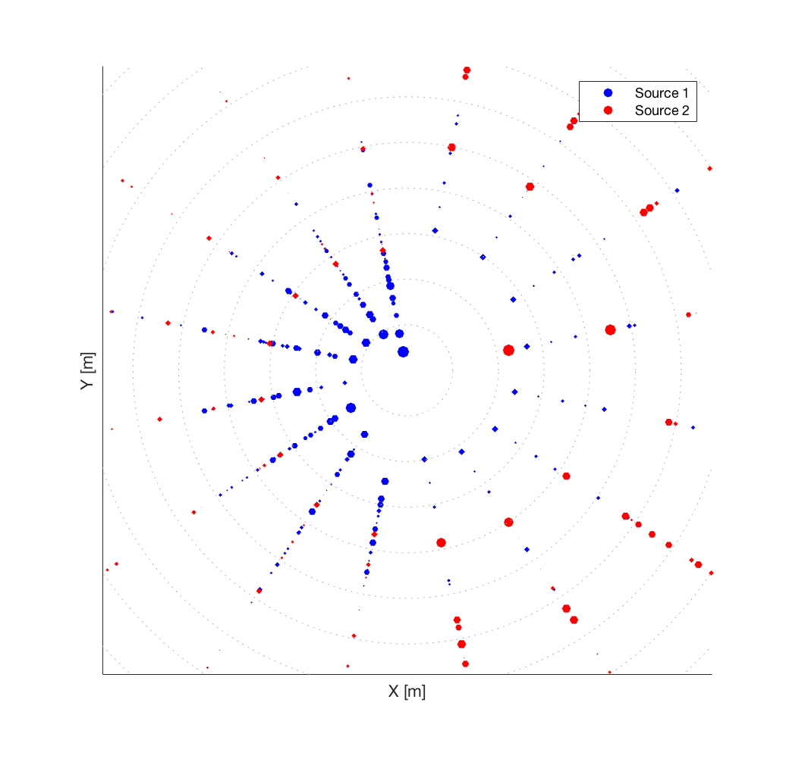
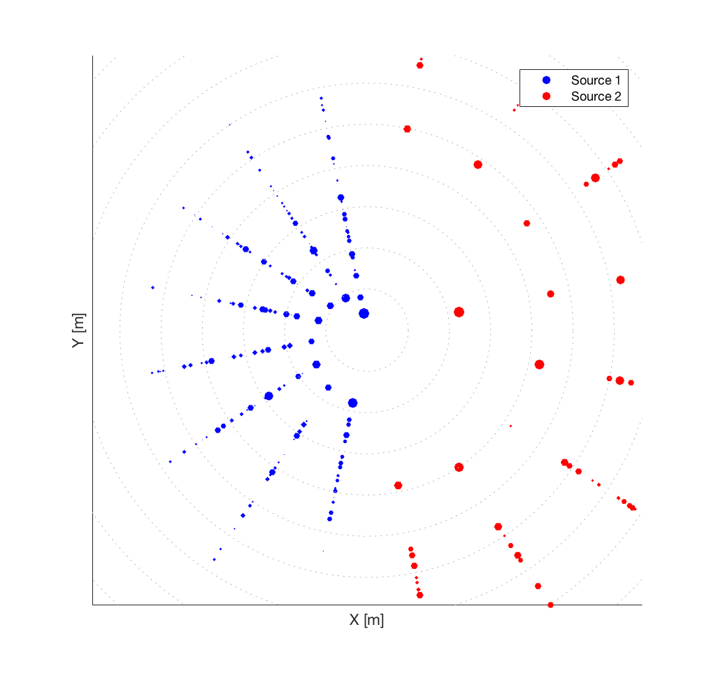

+++
# Project title.
title = "Sign-Agnostic Matrix Design for Spatial Artificial Reverberation with Feedback Delay Networks"

# Date this page was created.
date = 2016-04-27T00:00:00

# Project summary to display on homepage.
summary = "A central topic in the design of spatial FDNs is the choice of the feedback matrix that governs the interaction between spatially distributed elements and therefore the spatial impression."

# Tags: can be used for filtering projects.
# Example: `tags = ["machine-learning", "deep-learning"]`
tags = ["Feedback Delay Network"]

# Optional external URL for project (replaces project detail page).
external_link = ""

# Slides (optional).
#   Associate this project with Markdown slides.
#   Simply enter your slide deck's filename without extension.
#   E.g. `slides = "example-slides"` references 
#   `content/slides/example-slides.md`.
#   Otherwise, set `slides = ""`.
slides = ""

# Links (optional).

url_pdf = "http://www.aes.org/e-lib/browse.cfm?elib=19639"
url_custom = [{name="Paper", url="../../publication/schlecht2018tw/"}]

# Custom links (optional).
#   Uncomment line below to enable. For multiple links, use the form `[{...}, {...}, {...}]`.

# Featured image
# To use, add an image named `featured.jpg/png` to your project's folder. 
[image]
  # Caption (optional)
  caption = ""
  
  # Focal point (optional)
  # Options: Smart, Center, TopLeft, Top, TopRight, Left, Right, BottomLeft, Bottom, BottomRight
  focal_point = "Smart"
+++

<h3>Abstract</h3>
Feedback delay networks (FDNs) are an efficient tool for creating artificial reverberation. Recently, various designs for spatially extending the FDN were proposed. A central topic in the design of spatial FDNs is the choice of the feedback matrix that governs the interaction between spatially distributed elements and therefore the spatial impression. In the design prototype, the feedback matrix is chosen to be unilossless such that the reverberation time is infinite. However, in physics- and aesthetics-driven design of spatial FDNs, the target feedback matrix is not necessarily unilossless. This contribution proposes an optimization method for finding a close unilossless feedback matrix and improves the accuracy by relaxing the specification of the target matrix phase component and focussing on the sign-agnostic component.

<strong><strong>Figure 1:</strong></strong> Two-dimensional spatial FDN configuration similar to Stautner and Puckett, and similar to Schlecht et al.. The red arrows represents the feedback connections $\mathbf{A}$ between the delay lines; blue indicates the input $\mathbf{B}$, and green the output $\mathbf{C} = \mathbf{I}$. S and R indicate source and receiver, respectively.

<h3>Visualization</h3>

Spatial impulse responses in this section are visualized by scatter plots indicating the direction, distance, and energy of each reflection. All examples are assuming a two-dimensional circular setup for ease of visualization. Nonetheless, they are straightforwardly extendable to three dimensions. The energy of the reflections is reflected in dB by the point size. We depict the signal of each source with a different color to emphasize that the proposed structure can naturally handle multiple inputs and the given spatialization is source independent. Each source is only fed into a single delay line for ease of visualization. Further, the attenuation filter is individually controllable for each delay line such that we can define a direction-dependent reverberation time.

<h3>Spiral Feedback Delay Network Demo</h3>

The main purpose of the following example is to illustrate the spatial distribution conceptualized in the spatial FDN as depicted in Fig. 1. 

<video poster="" title="" controls="controls" style="" width="440" height=""><source src="animation_spiralFDN.mov" />Your browser does not support this video format.</video>

This design may be understood as a generalization of the classic Ping-Pong-Delay in Stereo reproduction. We choose the feedback matrix to be an orthogonal circular shifting matrix. This feedback matrix sends the signal from one delay line to the neighboring delay line in a circular fashion. The resulting spatial impulse response is depicted in Fig. 2 for three different sources. While this is an illustrative example, it has also an compelling artistic application, providing a swirling, spiral soundscape around the listener. 

 

<strong><strong>Figure 2:</strong></strong> Spatio-temporal position of reflections for three different source inputs in a spiral feedback configuration and 16 delay lines.

   

  

      Spiral FDN Demo - Binauralized - Please use headphones. A chord sequence is played by three synthesizer instances with left, center and right position. The spiral FDN response depends on the input position. 
  

  <ts-track title="Three Sources - Dry Sounds" data-img="">
      <ts-source src="spiralFDN_Dry.m4a" type="audio/mpeg"></ts-source>
  </ts-track>
  <ts-track title="Source 1 - Reverberated" data-img="">
      <ts-source src="spiralFDN_First.m4a" type="audio/mpeg"></ts-source>
  </ts-track>
  <ts-track title="Source 2 - Reverberated" data-img="">
      <ts-source src="spiralFDN_Second.m4a" type="audio/mpeg"></ts-source>
  </ts-track>
  <ts-track title="Source 3 - Reverberated" data-img="">
      <ts-source src="spiralFDN_Third.m4a" type="audio/mpeg"></ts-source>
  </ts-track>
  <ts-track title="Three Sources - Reverberated" data-img="">
      <ts-source src="spiralFDN_Everything.m4a" type="audio/mpeg"></ts-source>
  </ts-track>

<h3>Two Rooms Feedback Delay Network Demo</h3>

For the following example, we imagine to be located between two adjacent rooms with different reverberation times and tonal characteristics, e.g., on the right side a large hall with long reverberation time and on the left side a small chamber with strong damping. Whereas coupled rooms may be realized by two separated reverberators, we can also formulate it in a single compact structure. 

<video poster="" title="" controls="controls" style="" width="440" height=""><source src="animation_coupledFDN.mov" />Your browser does not support this video format.</video>

Here, the feedback matrix is a $2 \times 2$ block matrix such that where $\mathbf{R}_1$ and $\mathbf{R}_2$ are the feedback matrices of both rooms and the bleed matrices determine the bleed from one room to the other. Solving the sign-agnostic Procrustes problem yields a unilossless feedback matrix with the desired bleed $\beta$. Figure 3 depicts the resulting spatial impulse responses with $\beta = 0.1$ and $\beta = 0.0$. The delay lengths of the small chamber on the left are chosen smaller to model a higher echo density than for the large hall on the right. Instead of two distinct coupled rooms, the matrix design can be extended to a gradual bleed to the neighboring direction by target matrix $\mathbf{A}$ with where the bleed between delay lines increases with angular proximity. 

With Bleed             |  No Bleed
:-------------------------:|:-------------------------:
  |  

<strong><strong>Figure 3:</strong></strong> Spatio-temporal position of reflections for two different source inputs in a coupled room, where the left room is more damped than the right room. Source 1 is located in the left room and Source 2 is located in the right room. Over time the bleed increases between both rooms. The left plot shows the impulse response with bleed $\beta = 0.1$ and the right plot shows the impulse response without bleed $\beta = 0.0$.

  

      Two Rooms FDN Demo - Binauralized - Please use headphones. A jazz trio is playing in this coupled space: the bass stays on the left side, whereas the piano and drums both move in a circular fashion starting on the left and on the right, respectively.
  

  <ts-track title="Jazz Trio - Dry Sounds" data-img="">
      <ts-source src="twoRoomsFDN_Dry.m4a" type="audio/mpeg"></ts-source>
  </ts-track>
  <ts-track title="Drums Only - Reverberated - With Bleed" data-img="">
      <ts-source src="twoRoomsFDN_DrumsFull.m4a" type="audio/mpeg"></ts-source>
  </ts-track>
  <ts-track title="Piano Only - Reverberated - With Bleed" data-img="">
      <ts-source src="twoRoomsFDN_PianoFull.m4a" type="audio/mpeg"></ts-source>
  </ts-track>
  <ts-track title="Bass Only - Reverberated - With Bleed" data-img="">
      <ts-source src="twoRoomsFDN_BassFull.m4a" type="audio/mpeg"></ts-source>
  </ts-track>
  <ts-track title="Jazz Trio - Reverberated - With Bleed" data-img="">
      <ts-source src="twoRoomsFDN_Everything.m4a" type="audio/mpeg"></ts-source>
  </ts-track>
  <ts-track title="Drums Only - Reverberated - No Bleed" data-img="">
      <ts-source src="twoRoomsFDN_DrumsFull_noBleed.m4a" type="audio/mpeg"></ts-source>
  </ts-track>
  <ts-track title="Piano Only - Reverberated - No Bleed" data-img="">
      <ts-source src="twoRoomsFDN_PianoFull_noBleed.m4a" type="audio/mpeg"></ts-source>
  </ts-track>
  <ts-track title="Bass Only - Reverberated - No Bleed" data-img="">
      <ts-source src="twoRoomsFDN_BassFull_noBleed.m4a" type="audio/mpeg"></ts-source>
  </ts-track>
  <ts-track title="Jazz Trio - Reverberated - No Bleed" data-img="">
      <ts-source src="twoRoomsFDN_Everything_noBleed.m4a" type="audio/mpeg"></ts-source>
  </ts-track>

	