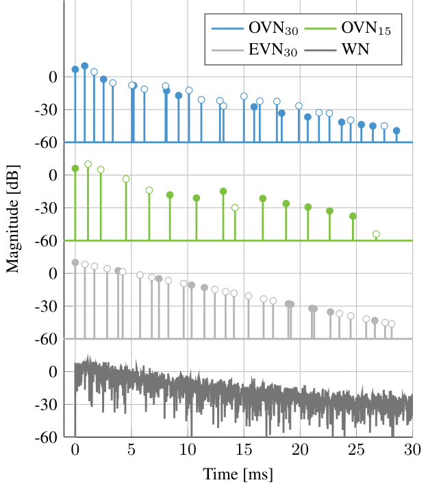

+++
title = "Optimized velvet-noise decorrelator "
date = 2018-01-01
authors = ["Sebastian Jiro Schlecht", "Benoit Alary", "Vesa Välimäki", "Emanuël A P Habets"]
publication_types = ["1"]
abstract = "This paper received the [2nd Best Paper Award](http://dafx2018.web.ua.pt/). Decorrelation of audio signals is a critical step for spatial sound reproduction on multichannel configurations. Correlated signals yield a focused phantom source between the reproduction loudspeakers and may produce undesirable comb-filtering artifacts when the signal reaches the listener with small phase differences. Decorrelation techniques reduce such artifacts and extend the spatial auditory image by randomizing the phase of a signal while minimizing the spectral coloration. This paper proposes a method to optimize the decorrelation properties of a sparse noise sequence, called velvet noise, to generate short sparse FIR decorrelation filters. The sparsity allows a highly efficient time-domain convolution. The listening test results demonstrate that the proposed optimization method can yield effective and colorless decorrelation filters. In comparison to a white noise sequence, the filters obtained using the proposed method preserve better the spectrum of a signal and produce good quality broadband decorrelation while using 76% fewer operations for the convolution. Satisfactory results can be achieved with an even lower impulse density which decreases the computational cost by 88%."

abstract_short = "This paper received the [2nd Best Paper Award](http://dafx2018.web.ua.pt/). Correlated signals yield a focused phantom source between the reproduction loudspeakers and may produce undesirable comb-filtering artifacts when the signal reaches the listener with small phase differences. Decorrelation techniques reduce such artifacts and extend the spatial auditory image by randomizing the phase of a signal while minimizing the spectral coloration. This paper proposes a method to optimize the decorrelation properties of a sparse noise sequence, called velvet noise, to generate short sparse FIR decorrelation filters."

selected = true
publication = "*Proc. Int. Conf. Digital Audio Effects (DAFx)*"
url_pdf = "http://dafx2018.web.ua.pt/papers/DAFx2018_paper_23.pdf"
url_project = "https://www.audiolabs-erlangen.de/resources/2018-DAFx-VND"
+++

<strong>**Figure 1:**</strong> Decorrelator sequences in the time domain: white noise $\mathrm{WN}$, exponential velvet noise $\mathrm{EVN}30$, and two optimized velvet-noise sequences $\mathrm{OVN}30$ and $\mathrm{OVN}15$. Positive impulses are indicated by $\bullet$ and negative gains by $\circ$ (except for $\mathrm{WN}$).

### Optimization

A central challenge in decorrelation is the coloration caused by a non-flat magnitude response of the decorrelator. The continuous formulation plays a critical role in the optimization process as it allows continuous modification of both impulse location and impulse gain.

    <video width="99%" height="540" autoplay loop muted markdown="1">
        <source src="animation_pulseOptimization.mov" type="video/mp4" markdown="1" >
    </video>

<strong>**Figure 2:**</strong> Single pulse optimization with corresponding phase slope of the frequency response.

The optimization problem is a constrained, non-linear and non-convex problem such that the optimal solution, i.e., the global minimum, is generally difficult to find. However, local minima can be attained by various gradient descent algorithms. Here we employ a variant of the interior-point method. The initial point is given by a randomly generated EVN.

    <video width="99%" height="540" autoplay loop muted markdown="1">
        <source src="animation_VNDoptimization.mov" type="video/mp4" markdown="1" >
    </video>

<strong>**Figure 3:**</strong> Complete optimization procedure of a velvet noise sequence and the corresponding magnitude response.

### Coloration Test

The first listening test evaluated how much the decorrelation filters colorate the input signal. The input signal was convolved with a single decorrelation filter, and the difference to the unprocessed signal was rated by the participants. In MUSHRA terminology, the unprocessed mono signal was the reference, and the input signal processed with a lowpass filter having a 3.5 kHz cutoff frequency was the anchor. The resulting mono signals were reproduced on both headphone channels. The main coloration was expected to be caused by the change in timbre and smearing of transients.

First set of decorrelators with drum signal
(audio: mono_drums_mono_original_t1.m4a title: Original Mono Track)
(audio: mono_drums_WNS_t1.m4a title: Exponential White Noise WN)
(audio: mono_drums_eVND_t1.m4a title: Exponential Velvet Noise EVN30)
(audio: mono_drums_oVND15_t1.m4a title: Optimized Velvet Noise OVN30)
(audio: mono_drums_oVND30_t1.m4a title: Optimized Velvet Noise OVN15)

First set of decorrelators with guitar signal
(audio: mono_guitar_mono_original_t1.m4a title: Original Mono Track)
(audio: mono_guitar_WNS_t1.m4a title: Exponential White Noise WN)
(audio: mono_guitar_eVND_t1.m4a title: Exponential Velvet Noise EVN30)
(audio: mono_guitar_oVND15_t1.m4a title: Optimized Velvet Noise OVN30)
(audio: mono_guitar_oVND30_t1.m4a title: Optimized Velvet Noise OVN15)

First set of decorrelators with female vocalist
(audio: mono_song_mono_original_t1.m4a title: Original Mono Track)
(audio: mono_song_WNS_t1.m4a title: Exponential White Noise WN)
(audio: mono_song_eVND_t1.m4a title: Exponential Velvet Noise EVN30)
(audio: mono_song_oVND15_t1.m4a title: Optimized Velvet Noise OVN30)
(audio: mono_song_oVND30_t1.m4a title: Optimized Velvet Noise OVN15)

First set of decorrelators with speech signal
(audio: mono_speech_mono_original_t1.m4a title: Original Mono Track)
(audio: mono_speech_WNS_t1.m4a title: Exponential White Noise WN)
(audio: mono_speech_eVND_t1.m4a title: Exponential Velvet Noise EVN30)
(audio: mono_speech_oVND15_t1.m4a title: Optimized Velvet Noise OVN30)
(audio: mono_speech_oVND30_t1.m4a title: Optimized Velvet Noise OVN15)

### Stereo Quality Test

The second listening test evaluated the effectiveness of the decorrelators in extending the auditory source width and the overall spatial quality. The input signal was convolved with a decorrelation filter for each channel (left and right) and the participants were asked to rate the perceived width, localization at the center, and overall quality. In this test, no ideal reference could be defined, so the unprocessed mono signal was provided only for guidance. The lowpass filtered mono signal was given as the anchor. The resulting stereo signal was reproduced on the left and right headphone channels. 

First set of decorrelators with drum signal
(audio: sdrums_mono_original_t1.m4a title: Original Mono Track)
(audio: sdrums_WNS_t1.m4a title: Exponential White Noise WN)
(audio: sdrums_eVND_t1.m4a title: Exponential Velvet Noise EVN30)
(audio: sdrums_oVND15_t1.m4a title: Optimized Velvet Noise OVN30)
(audio: sdrums_oVND30_t1.m4a title: Optimized Velvet Noise OVN15)

    

First set of decorrelators with guitar signal
(audio: guitar_mono_original_t1.m4a title: Original Mono Track)
(audio: guitar_WNS_t1.m4a title: Exponential White Noise WN)
(audio: guitar_eVND_t1.m4a title: Exponential Velvet Noise EVN30)
(audio: guitar_oVND15_t1.m4a title: Optimized Velvet Noise OVN30)
(audio: guitar_oVND30_t1.m4a title: Optimized Velvet Noise OVN15)

First set of decorrelators with female vocalist
(audio: song_mono_original_t1.m4a title: Original Mono Track)
(audio: song_WNS_t1.m4a title: Exponential White Noise WN)
(audio: song_eVND_t1.m4a title: Exponential Velvet Noise EVN30)
(audio: song_oVND15_t1.m4a title: Optimized Velvet Noise OVN30)
(audio: song_oVND30_t1.m4a title: Optimized Velvet Noise OVN15)

First set of decorrelators with speech signal
(audio: speech_mono_original_t1.m4a title: Original Mono Track)
(audio: speech_WNS_t1.m4a title: Exponential White Noise WN)
(audio: speech_eVND_t1.m4a title: Exponential Velvet Noise EVN30)
(audio: speech_oVND15_t1.m4a title: Optimized Velvet Noise OVN30)
(audio: speech_oVND30_t1.m4a title: Optimized Velvet Noise OVN15)

